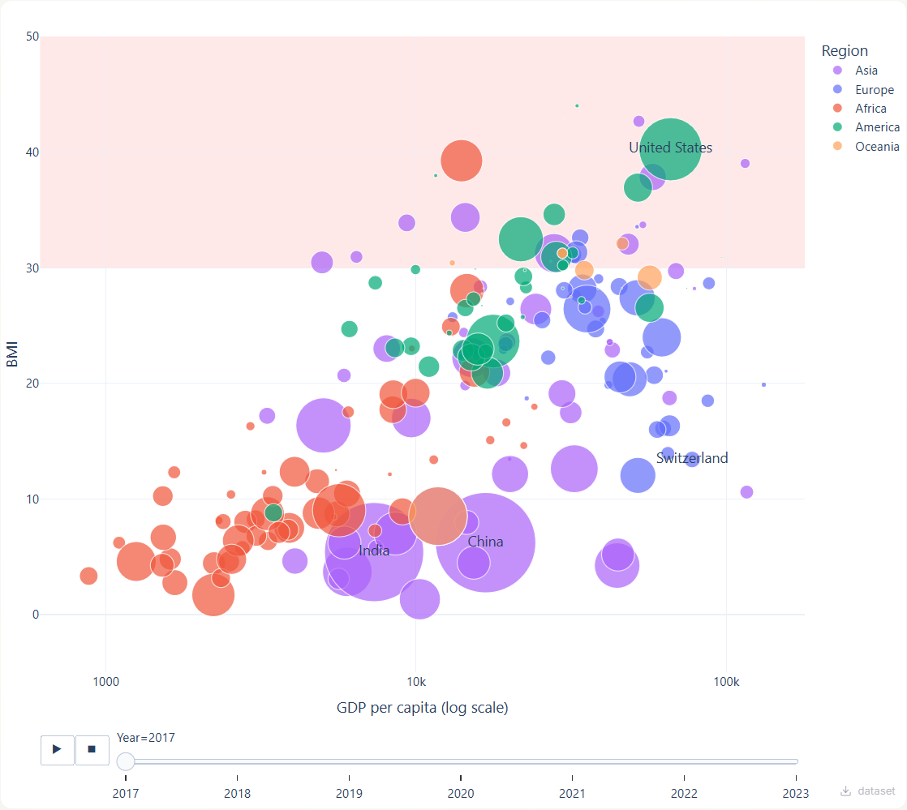
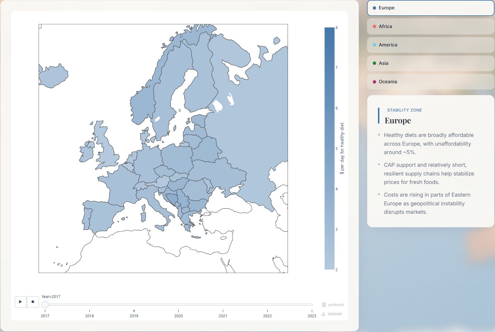
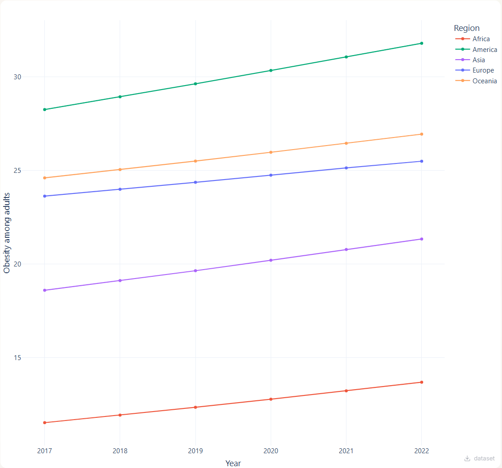

SUPSI 2025-26  
Data Visualization course

# Where you live determines what you eat
Authors: [Artem Starodubtsev](https://github.com/artem-starodubtsev), [Petar Hristov Neykov](https://github.com/peykoff), [Mahdi Hamrouni](https://github.com/MahdiHamrouni)

We do not have a web page as we need to deploy backend.

Here is how you can launch app:

```terminaloutput
cd <project_root>

docker compose up
```

after that navigate to [localhost:5173](localhost:5173)

## Abstract
This project examines the profound influence of geographic location and socioeconomic status on individual nutritional outcomes and lifestyle behaviors. While globalization has increased food availability, it has also created a "food environment" disparity where wealth and location dictate access to quality nutrition. Exploring scientific, geographical and financial data, this study analyzes relationships between the citated factors and how they vary over continents. The findings suggest that health is not merely a result of individual "willpower," but is heavily structured by the cultural, environmental and financial constraints of one's surroundings. The project concludes by exposing some of the insights captured by the group.

## Introduction
Madhi

## Data sources
Petar put links to datasets here below:

[Dataset 1 on obesity](https://ourworldindata.org/grapher/share-of-adults-defined-as-obese?v=1&csvType=full&useColumnShortNames=false)

[Dataset 2 on the world population](https://ourworldindata.org/grapher/population-with-un-projections?v=1&csvType=full&useColumnShortNames=false)

[Dataset 3 on the cost of a healty diet](https://ourworldindata.org/grapher/cost-healthy-diet?v=1&csvType=full&useColumnShortNames=false)

[Dataset 4 on GDP per capita](https://ourworldindata.org/grapher/gdp-per-capita-worldbank?v=1&csvType=full&useColumnShortNames=false)

## Data pre-processing
Petar

```Python
import pandas as pd

df = pd.read_excel("data/data.xlsx")

df = df[df["Entity"] != "World"]
df = df[df["Entity"].isin(set(df.loc[df["Year"] == 2018, "Entity"]))]
```

## Data visualizations
ABOBA

### Wealth vs. BMI
[]()

### Regional Overview
[]()

### Obesity Trend
[]()


## Key findings
Mahdi

## Next steps
???
